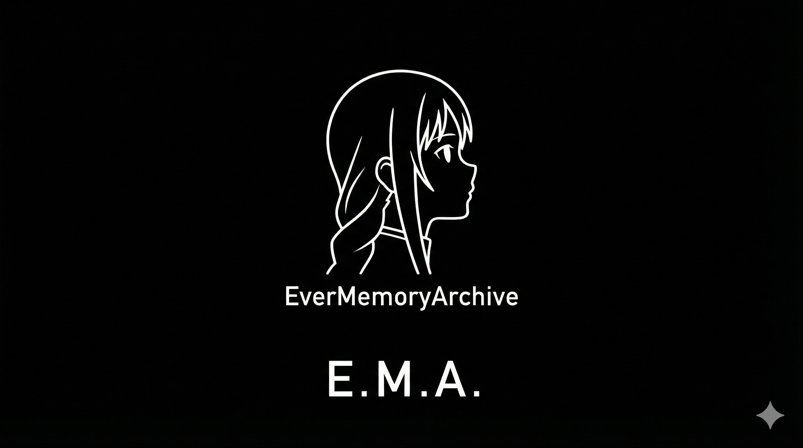
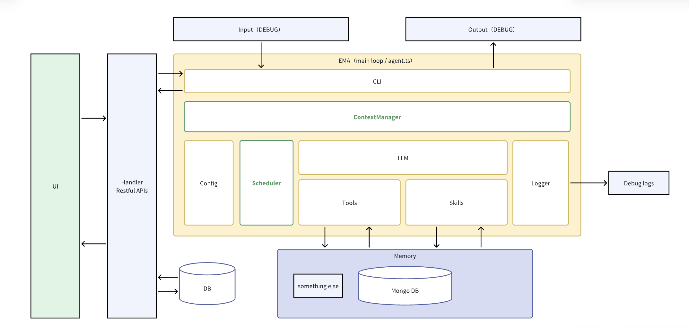

# EverMemoryArchive


English | [中文](./README_CN.md)

**EverMemoryArchive** represents Ema Fan Club's initiative to imbue agents with continuously evolving personalities via long-term memory mechanisms. Our goal is to build AI companions that truly understand you—functioning as versatile assistants for daily operations while serving as empathetic partners attuned to your emotional landscape.


## Framework



## Getting Started

```bash
pnpm install
```

Run or develop application:

```bash
pnpm start
# or
pnpm dev
```

## Contributing

See [CONTRIBUTING.md](./CONTRIBUTING.md) for details.
